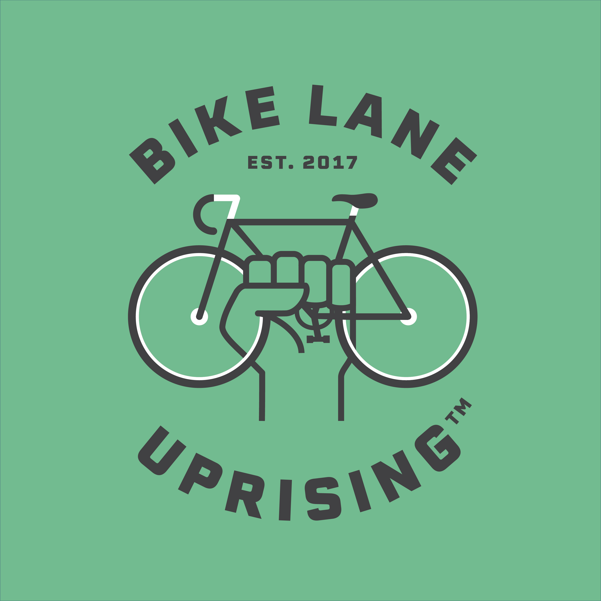

```{r setup, include=FALSE}
knitr::opts_chunk$set(echo = FALSE)
library(RUGtools)
```

## Chicago R User Group (CRUG) ...

- CRUG is in it's 9th year of meetups!
- Now reached 3,500 members, one of largest groups in world!

    **Slack**
     
    [bit.ly/Slack-CRUG](http://bit.ly/Slack-CRUG)

    **Twitter**
    
    [ChicagoRusers](https://twitter.com/ChicagoRusers)

    **GitHub**
    
    @[Chicago-R-User-Group](https://github.com/Chicago-R-User-Group)

    **Meetup**
    
    [ChicagoRUG](https://www.meetup.com/ChicagoRUG/)

    **Website**
    
    [Chicago-r-user-group.github.io](https://chicago-r-user-group.github.io/)

# Local R News

## 

<br/>

From the inaugural conference in 2009, the annual R/Finance conference in Chicago has become the primary meeting for academics and practitioners interested in using R in Finance.

https://uic.cvent.com/rfinance2019CFP


## 


<br/>
Next Meetup: 

- Tuesday, March 26th
    R-Ladies Chicago welcomes Mara Averick: Sustainers of the Tidyverse

For more information find them:

https://rladieschicago.org/>

@[RLadiesChicago](https://twitter.com/RLadiesChicago)

[Meetup.com/R-Ladies Chicago](https://www.meetup.com/rladies-chicago/)

## 


<br/>

> The workshop will be appropriate for analysts who are familiar with classical statistical methods and ideas such as regression and confidence intervals. Participants interested in implementing some of the statistical methods during the workshop should bring a laptop that includes R software. 

https://s01.123signup.com/servlet/SignUpMember?PG=1531573182300&P=15315731911433509500&Info

# Anyone hiring R folks? 

# Tonight's Sponsors

## Chicago Women in Big Data

https://www.meetup.com/Chicago-Women-in-Big-Data


WeWork provides shared workspaces for technology startup, and services for entrepreneurs, freelancers, startups, small businesses and large enterprises. 

<br/>


IBM for sponsoring food and beverages!


# Tonight's Event

## Big Data & Biking: Bike Lane Uprising {.vcenter .flexbox}



**Agenda**

1. **Kim Brown**, Chicago Women in Big Data
2. **Troy Hernandez**, Chicago R User Group
3. **Christina Whitehouse**, Bike Lane Uprising

# Leaflet

## BLU's Maps {.vcenter .flexbox}


## Troy's Maps {.vcenter .flexbox .smaller}

Crime in Chicago’s Community Areas

https://troyhernandez.com/2019/03/12/crime-in-chicagos-community-areas/


## Chicago Data Portal's Map {.vcenter .flexbox .smaller}


## Code {.smaller}

```{r, echo = TRUE, warning=FALSE}
library(leaflet)
library(sp)
bikeracks <- read.csv("data/Bike_Racks.csv")
head(bikeracks)
```

## Code

```{r, echo = TRUE, eval = FALSE}
leaflet() %>%
  addTiles() %>%
  addCircles(lng = bikeracks$Longitude, lat = bikeracks$Latitude,
               radius = .5, opacity = 1, col = "blue")
```

https://gis.stackexchange.com/questions/168886/r-how-to-build-heatmap-with-the-leaflet-package

https://rstudio.github.io/leaflet/

## Code {.smaller}

```{r, echo = FALSE}
# pal2 <- colorNumeric("RdBu", domain = c(-max(chicommunities$growth),
#                                         max(chicommunities$growth)),
#                      reverse = TRUE)

leaflet() %>%
  addTiles() %>%
  addCircles(lng = bikeracks$Longitude, lat = bikeracks$Latitude,
               radius = .5, opacity = 1, col = "blue")
```

## Post BLU Brainstorm/Hack

**How do we use this and other data to make biking, and the rest of our city, better?**